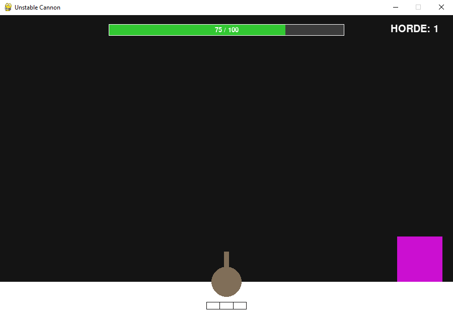
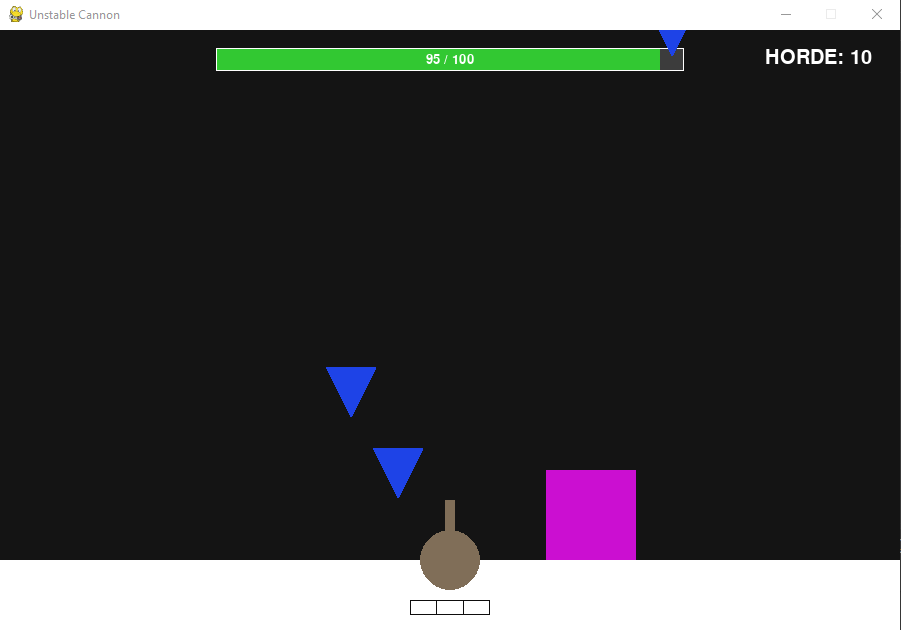
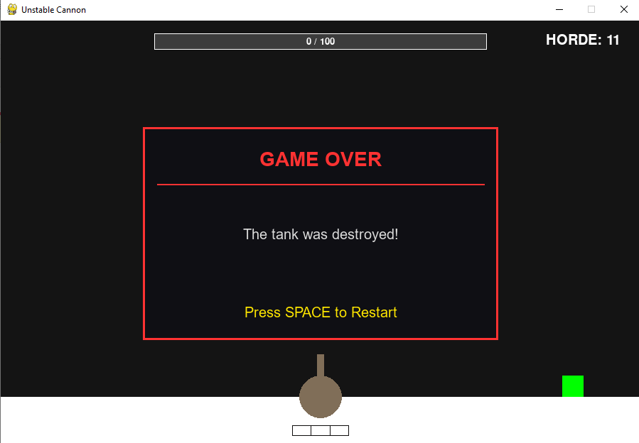

# Unstable Cannon

**Unstable Cannon** is a fast-paced 2D 2D endless horde survival arcade game built in Python using Pygame for a Game Jam.

---

## 🕹️ About the Game
In **Unstable Cannon**, you control a stationary tank at the center of the arena. Your goal is to survive as long as possible against relentless waves of geometric enemies (squares and triangles) whose speed, health, and size mutate unpredictably over time.

> **Developer Note:** This game was created during a 5-day Game Jam. Due to the strict time limit, I wasn't able to fully finish all planned features, but the core horde survival loop is fully playable.

---

## 📸 Screenshots

| Gameplay 1 | Gameplay 2 | Gameplay 3 |
| :---: | :---: | :---: |
|  |  |  |

---

## 🎮 How to Play

### Controls
* **WASD / Arrow Keys:** Aim the cannon
* **SPACE:** Basic Shot
* **Q:** Big Shot
* **E:** Super Laser
* **P / ESC:** Pause

### Installation
1. Download `main.exe` from the latest release.
2. Double-click `main.exe` to run the game.

---

## 🛠️ Built With
* **Python**
* **Pygame**
* **PyInstaller** (Packaging)